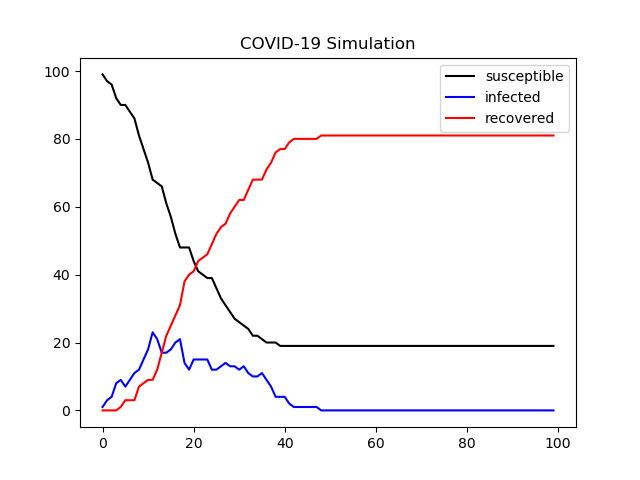

# Modellierungen

Here we are creating the base simulation(s) for our project. We will make a SIR model and later a celluar automate.

This is supposed to help us understanding the spread of COVID-19 and analyse different aspects like immunity practical use of a corona app and others

# Our models
## Basic SIR model

This model is only percentage driven and can not be configured very much.

In the image below you see the default output of the model. You can modify the distribution of infected people and adjust some variables about the spreading

## The Cellular Automat

This is a model which can be modified very much. It does not contain that much math but is capable to do much more specified analyzes and provides more data.

